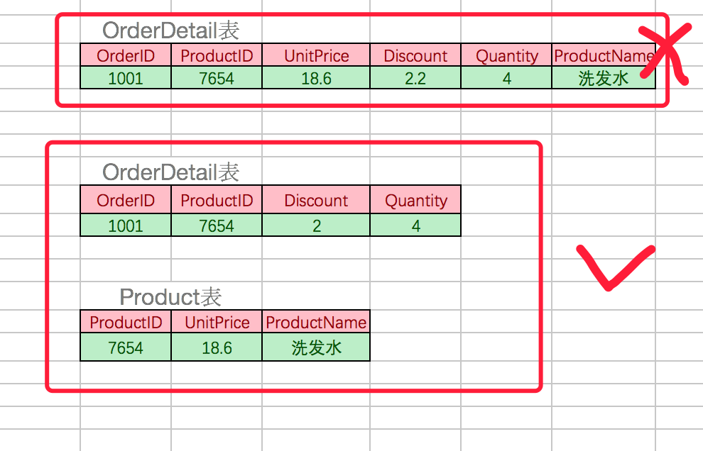
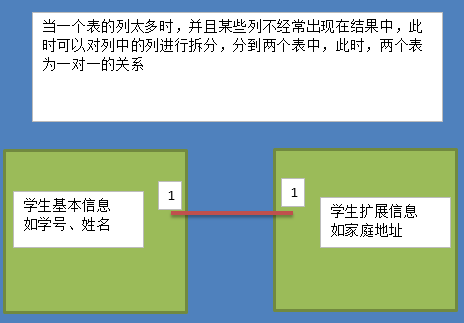
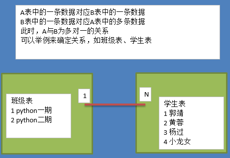

## 1、数据存储

- 以前是这样记录的：结绳记事

- 也有这样记录的：甲骨

- 后来开始这样记录：图书

**传统记录数据的缺点:**

- 不易保存
- 备份困难
- 查找不便

**现代化手段----文件**

- 使用简单，例如python中的open可以打开文件，用read/write对文件进行读写，close关闭文件
- 对于数据容量较大的数据，不能够很好的满足，而且性能较差
- 不易扩展

**现代化手段----数据库**

- 持久化存储
- 读写速度极高
- 保证数据的有效性
- 对程序支持性非常好，容易扩展

**真实的仓库是这样的:**

**我们看到的是这个样子的**

**顾客看到的是这个样子的:**

## 2、数据库

数据库就是一种特殊的文件，其中存储着需要的数据

关系型数据库核心元素

- 数据行(记录)
- 数据列(字段)
- 数据表(数据行的集合)
- 数据库(数据表的集合)

## 3、RDBMS

RDBMS 是 "Relational Database Management System" 的缩写，中文意思是关系型数据库管理系统。它是一种广泛使用的数据库管理系统，用于存储结构化数据。RDBMS 的核心概念是“关系”，即数据通过行和列的表格（通常称为关系或表）来表示，并且表之间通过键来建立关系。

- 当前主要使用两种类型的数据库：关系型数据库、非关系型数据库
- 所谓的关系型数据库RDBMS，是建立在关系模型基础上的数据库，借助于集合代数等数学概念和方法来处理数据库中的数据
- 查看数据库排名:https://db-engines.com/en/ranking
- 关系型数据库的主要产品：
  - oracle：在以前的大型项目中使用,银行,电信等项目
  - mysql：web时代使用最广泛的关系型数据库
  - sqlite：轻量级数据库，主要应用在移动平台

## 4、RDBMS和数据库的关系

## 5、SQL

> Structured Query Language

SQL是结构化查询语言，是一种用来操作RDBMS的数据库语言，当前关系型数据库都支持使用SQL语言进行操作,也就是说可以通过 SQL 操作 oracle,sql server,mysql,sqlite 等等所有的关系型的数据库

- SQL语句主要分为：
  - **DQL：数据查询语言，用于对数据进行查询，如select**
  - **DML：数据操作语言，对数据进行增加、修改、删除，如insert、udpate、delete**
  - TPL：事务处理语言，对事务进行处理，包括begin transaction、commit、rollback
  - DCL：数据控制语言，进行授权与权限回收，如grant、revoke
  - DDL：数据定义语言，进行数据库、表的管理等，如create、drop
  - CCL：指针控制语言，通过控制指针完成表的操作，如declare cursor
- 对于web程序员来讲，重点是数据的crud（增删改查），必须熟练编写DQL、DML，能够编写DDL完成数据库、表的操作，其它语言如TPL、DCL、CCL了解即可
- SQL 是一门特殊的语言,专门用来操作关系数据库
- 不区分大小写

## 6、数据完整性

一个数据库就是一个完整的业务单元，可以包含多张表，数据被存储在表中

在表中为了更加准确的存储数据，保证数据的正确有效，可以在创建表的时候，为表添加一些强制性的验证，包括数据字段的类型、约束

### （1）数据类型

可以通过查看帮助文档查阅所有支持的数据类型

使用数据类型的原则是：够用就行，尽量使用取值范围小的，而不用大的，这样可以更多的节省存储空间

常用数据类型如下：
- 整数：int，bit
- 小数：decimal
- 字符串：varchar,char
- 日期时间: date, time, datetime
- 枚举类型(enum)

特别说明的类型如下：
- decimal表示浮点数，如decimal(5,2)表示共存5位数，小数占2位
- char表示固定长度的字符串，如char(3)，如果填充'ab'时会补一个空格为`'ab '`
- varchar表示可变长度的字符串，如varchar(3)，填充'ab'时就会存储'ab'
- 字符串text表示存储大文本，当字符大于4000时推荐使用
- 对于图片、音频、视频等文件，不存储在数据库中，而是上传到某个服务器上，然后在表中存储这个文件的保存路径

- 更全的数据类型可以参考http://blog.csdn.net/anxpp/article/details/51284106

### （2）约束

- 主键primary key：物理上存储的顺序
- 非空not null：此字段不允许填写空值
- 唯一unique：此字段的值不允许重复
- 默认default：当不填写此值时会使用默认值，如果填写时以填写为准
- 外键foreign key：对关系字段进行约束，当为关系字段填写值时，会到关联的表中查询此值是否存在，如果存在则填写成功，如果不存在则填写失败并抛出异常
- 说明：虽然外键约束可以保证数据的有效性，但是在进行数据的crud（增加、修改、删除、查询）时，都会降低数据库的性能，所以不推荐使用，那么数据的有效性怎么保证呢？答：可以在逻辑层进行控制

### （3）数值类型(常用)

| 类型        | 字节大小 | 有符号范围(Signed)                         | 无符号范围(Unsigned)     |
| :---------- | :------- | :----------------------------------------- | :----------------------- |
| TINYINT     | 1        | -128 ~ 127                                 | 0 ~ 255                  |
| SMALLINT    | 2        | -32768 ~ 32767                             | 0 ~ 65535                |
| MEDIUMINT   | 3        | -8388608 ~ 8388607                         | 0 ~ 16777215             |
| INT/INTEGER | 4        | -2147483648 ~2147483647                    | 0 ~ 4294967295           |
| BIGINT      | 8        | -9223372036854775808 ~ 9223372036854775807 | 0 ~ 18446744073709551615 |

> 字符串

| 类型    | 字节大小 | 示例                                                         |
| :------ | :------- | :----------------------------------------------------------- |
| CHAR    | 0-255    | 类型:char(3) 输入 'ab', 实际存储为'ab ', 输入'abcd' 实际存储为 'abc' |
| VARCHAR | 0-255    | 类型:varchar(3) 输 'ab',实际存储为'ab', 输入'abcd',实际存储为'abc' |
| TEXT    | 0-65535  | 大文本                                                       |

> 日期时间类型

| 类型      | 字节大小 | 示例                                                  |
| :-------- | :------- | :---------------------------------------------------- |
| DATE      | 4        | '2020-01-01'                                          |
| TIME      | 3        | '12:29:59'                                            |
| DATETIME  | 8        | '2020-01-01 12:29:59'                                 |
| YEAR      | 1        | '2017'                                                |
| TIMESTAMP | 4        | '1970-01-01 00:00:01' UTC ~ '2038-01-01 00:00:01' UTC |

## 7、数据库设计

关系型数据库建议在E-R模型的基础上，我们需要根据产品经理的设计策划，抽取出来模型与关系，制定出表结构，这是项目开始的第一步

在开发中有很多设计数据库的软件，常用的如power designer，db desinger等，这些软件可以直观的看到实体及实体间的关系

设计数据库，可能是由专门的数据库设计人员完成，也可能是由开发组成员完成，一般是项目经理带领组员来完成

### （1）三范式

经过研究和对使用中问题的总结，对于设计数据库提出了一些规范，这些规范被称为范式(Normal Form)

目前有迹可寻的共有8种范式，一般需要遵守3范式即可

- 第一范式（1NF）：强调的是列的原子性，即列不能够再分成其他几列。

考虑这样一个表：【联系人】（姓名，性别，电话） 如果在实际场景中，一个联系人有家庭电话和公司电话，那么这种表结构设计就没有达到 1NF。要符合 1NF 我们只需把列（电话）拆分，即：【联系人】（姓名，性别，家庭电话，公司电话）。1NF 很好辨别，但是 2NF 和 3NF 就容易搞混淆。

-  第二范式（2NF）：首先是 1NF，另外包含两部分内容，一是表必须有一个主键；二是没有包含在主键中的列必须完全依赖于主键，而不能只依赖于主键的一部分。

考虑一个订单明细表：【OrderDetail】（OrderID，ProductID，UnitPrice，Discount，Quantity，ProductName）。 因为我们知道在一个订单中可以订购多种产品，所以单单一个 OrderID 是不足以成为主键的，主键应该是（OrderID，ProductID）。显而易见 Discount（折扣），Quantity（数量）完全依赖（取决）于主键（OderID，ProductID），而 UnitPrice，ProductName 只依赖于 ProductID。所以 OrderDetail 表不符合 2NF。不符合 2NF 的设计容易产生冗余数据。

可以把【OrderDetail】表拆分为【OrderDetail】（OrderID，ProductID，Discount，Quantity）和【Product】（ProductID，UnitPrice，ProductName）来消除原订单表中UnitPrice，ProductName多次重复的情况。

- 第三范式（3NF）：首先是 2NF，另外非主键列必须直接依赖于主键，不能存在传递依赖。即不能存在：非主键列 A 依赖于非主键列 B，非主键列 B 依赖于主键的情况。

考虑一个订单表【Order】（OrderID，OrderDate，CustomerID，CustomerName，CustomerAddr，CustomerCity）主键是（OrderID）。 其中 OrderDate，CustomerID，CustomerName，CustomerAddr，CustomerCity 等非主键列都完全依赖于主键（OrderID），所以符合 2NF。不过问题是 CustomerName，CustomerAddr，CustomerCity 直接依赖的是 CustomerID（非主键列），而不是直接依赖于主键，它是通过传递才依赖于主键，所以不符合 3NF。 通过拆分【Order】为【Order】（OrderID，OrderDate，CustomerID）和【Customer】（CustomerID，CustomerName，CustomerAddr，CustomerCity）从而达到 3NF。 *第二范式（2NF）和第三范式（3NF）的概念很容易混淆，区分它们的关键点在于，2NF：非主键列是否完全依赖于主键，还是依赖于主键的一部分；3NF：非主键列是直接依赖于主键，还是直接依赖于非主键列。

### （2）不遵循1NF

### （3）不遵循2NF

### （4）不遵循3NF

### （5）最终表

### （6）E-R模型

E表示entry，实体，设计实体就像定义一个类一样，指定从哪些方面描述对象，一个实体转换为数据库中的一个表

R表示relationship，关系，关系描述两个实体之间的对应规则，关系的类型包括包括一对一、一对多、多对多

关系也是一种数据，需要通过一个字段存储在表中

实体A对实体B为1对1，则在表A或表B中创建一个字段，存储另一个表的主键值

- 实体A对实体B为1对多：在表B中创建一个字段，存储表A的主键值

- 实体A对实体B为多对多：新建一张表C，这个表只有两个字段，一个用于存储A的主键值，一个用于存储B的主键值

### （7）逻辑删除

- 对于重要数据，并不希望物理删除，一旦删除，数据无法找回
- 删除方案：设置isDelete的列，类型为bit，表示逻辑删除，默认值为0
- 对于非重要数据，可以进行物理删除
- 数据的重要性，要根据实际开发决定

