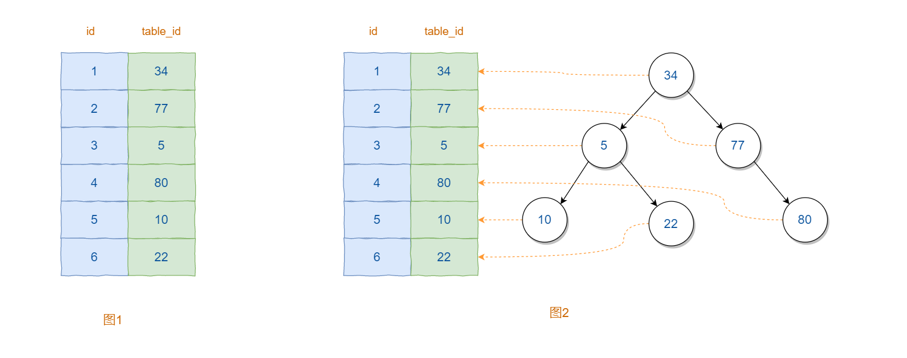

## 1、思考

> 在图书馆中是如何找到一本书的？

一般的应用系统对比数据库的读写比例在10:1左右(即有10次查询操作时有1次写的操作)，

而且插入操作和更新操作很少出现性能问题，

遇到最多、最容易出问题还是一些复杂的查询操作，所以查询语句的优化显然是重中之重

## 2、解决办法

当数据库中数据量很大时，查找数据会变得很慢

优化方案：索引

## 3、索引是什么

索引是一种特殊的文件(InnoDB数据表上的索引是表空间的一个组成部分)，它们包含着对数据表里所有记录的引用指针。

更通俗的说，数据库索引好比是一本书前面的目录，能加快数据库的查询速度

## 4、索引目的

索引的目的在于提高查询效率，可以类比字典，如果要查“mysql”这个单词，我们肯定需要定位到m字母，然后从下往下找到y字母，再找到剩下的sql。如果没有索引，那么你可能需要把所有单词看一遍才能找到你想要的，如果我想找到m开头的单词呢？或者ze开头的单词呢？是不是觉得如果没有索引，这个事情根本无法完成？

## 5、索引原理

除了词典，生活中随处可见索引的例子，如火车站的车次表、图书的目录等。它们的原理都是一样的，通过不断的缩小想要获得数据的范围来筛选出最终想要的结果，同时把随机的事件变成顺序的事件，也就是我们总是通过同一种查找方式来锁定数据。

数据库也是一样，但显然要复杂许多，因为不仅面临着等值查询，还有范围查询(>、<、between、in)、模糊查询(like)、并集查询(or)等等。数据库应该选择怎么样的方式来应对所有的问题呢？我们回想字典的例子，能不能把数据分成段，然后分段查询呢？最简单的如果1000条数据，1到100分成第一段，101到200分成第二段，201到300分成第三段……这样查第250条数据，只要找第三段就可以了，一下子去除了90%的无效数据。

## 6、概述

Mysql中的索引（index）本身也是一种数据结构，它主要用来帮助Mysql提高获取数据库中数据的效率。具体来说，索引是一种满足特定查找算法的数据结构，它通过某种方式引用数据，在索引之上就可以实现高级的查找算法。

如果理解索引对于数据获取的帮助呢？如果数据库中表的记录条数很少，那么查询的效率往往都很高。然而，在复杂的业务场景下，数据库中表的记录往往非常的多，这时简单的查询操作也会受到表容量的影响，相应的速度往往会很慢。例如，对于查询操作而言，表中的数据是如下图1所示的结构，查询某个记录需要遍历整张表。假设表中记录总条数为N，那么时间复杂度就是O(N)。


既然线程结构时间复杂度较高，那么根据数据结构的知识可知，如果将其转换为二叉树，那么时间复杂度将变为O(logN)。因此，可以根据现有的数据创建如上图所示的二叉树，其中二叉树中的每个节点分别对应中表中的某一条记录。这样，利用二叉树的特性就可以有效的提升查询的效率。

### （1）优缺点

索引虽然可以提升查询数据库的效率，但是它仍有不足之处：

索引本身也是一张表，表中保存了主键和索引字段，并指向实体类的记录。通常将索引以索引文件的形式保存在磁盘上，因此，索引也会占用一定的磁盘空间

索引降低了更新表的速度，更新表时，MySQL 不仅要保存数据，还要保存一下索引文件，每次更新添加了索引列的字段，都会调整因为更新所带来的键值变化后的索引信息。

### （2）类型

索引是在MySQL的存储引擎层中实现的，目前Mysql中支持如下的四种索引类型：

- BTree索引：大部分的存储引擎都支持

- HASH索引：只有MEMORY支持
- R-tree索引，空间索引：主要用于地理空间数据类型
- FUll-text，全文索引：MyISAM和InnoDB都支持

它们之间的比较如下：

| 索引类型  | InnoDB | MyISAM | MEMORY |
| :-------: | :----: | :----: | :----: |
|  BETREE   |  支持  |  支持  |  支持  |
|   HASH    | 不支持 | 不支持 |  支持  |
|  R-tree   | 不支持 |  支持  | 不支持 |
| Full-text |  5.6~  |  支持  | 不支持 |


通常所说的索引都是B+Tree索引。

第一部分说到，类似二叉树的树形结构可以帮助提升查询数据库的效率，那么Mysql中的索引采用的是哪种树呢？下面我们来看一下什么是BTree和B+Tree。

### （3）B-Tree 索引

B-Tree 索引是 MySQL 中最常用的索引类型之一。B-Tree 索引使用 B-Tree 数据结构来存储索引值，并且支持数据的快速查询和排序。B-Tree 索引适用于范围查询，例如使用 >、>=、<、<= 或 BETWEEN 操作符的查询。

### （4）哈希索引

哈希索引使用哈希函数将索引值映射到哈希表中的桶。哈希索引适用于等值查询，例如使用 = 或 IN 操作符的查询。哈希索引不能用于排序，也不支持范围查询。

### （5）全文索引

全文索引用于全文搜索，它可以快速查找文本字段中的关键词或短语。全文索引适用于文本搜索，例如在博客、论坛或电子商务网站中搜索商品、评论或文章。

需要注意的是，索引的类型应根据数据的特点和查询需求进行选择。在实际应用中，不同类型的索引通常都有其各自的优点和局限性。因此，应该根据实际情况选择最适合的索引类型，以获得最佳的性能和可靠性。

在本节中，我们将重点介绍 B-Tree 索引，因为它是 MySQL 中最常用的索引类型。

## 7、创建索引

在 MySQL 中，可以使用 CREATE INDEX 语句创建索引。例如，以下语句将为 "customers" 表的 "last_name" 列创建一个名为 "last_name_idx" 的 B-Tree 索引：

```mysql
CREATE INDEX last_name_idx ON customers (last_name);
```

在这个示例中，我们使用 CREATE INDEX 语句创建了一个名为 "last_name_idx" 的 B-Tree 索引，并指定了要为其创建索引的列 "last_name"。

## 8、查看索引

可以使用 SHOW INDEX 语句查看表中的索引列表。例如，以下语句将显示 "customers" 表的索引列表：

```mysql
SHOW INDEX FROM customers;
```

在这个示例中，我们使用 SHOW INDEX 语句查看了 "customers" 表的索引列表。

## 9、使用索引

在查询表时，可以使用 WHERE 子句和索引来加速查询的速度。例如，以下查询将使用名为 "last_name_idx" 的 B-Tree 索引来检索 "customers" 表中姓氏为 "Smith" 的所有客户：

```mysql
SELECT * FROM customers WHERE last_name = 'Smith';
```

在这个示例中，我们使用 WHERE 子句和索引来检索 "customers" 表中姓氏为 "Smith" 的所有客户。

## 10、删除索引

可以使用 DROP INDEX 语句删除索引。例如，以下语句将删除 "last_name_idx" 索引：

```mysql
DROP INDEX last_name_idx ON customers;
```

在这个示例中，我们使用 DROP INDEX 语句删除了名为 "last_name_idx" 的索引。

## 11、示例

### （1）创建数据库

首先，我们可以使用以下语句创建一个名为 "demo_db" 的 MySQL 数据库：

```mysql
CREATE DATABASE demo_db;

# 使用数据库
use demo_db;
```

### （2）创建表

接下来，我们可以创建一个名为 "employees" 的表，其中包含员工的姓名、工资和入职日期。我们可以使用以下语句创建这个表：

```mysql
CREATE TABLE employees (
  id INT NOT NULL PRIMARY KEY,
  name VARCHAR(50),
  salary DECIMAL(10,2),
  hire_date DATE
);
```

在这个示例中，我们使用 CREATE TABLE 语句创建了一个名为 "employees" 的表，并指定了四个列：id、name、salary 和 hire_date。其中，id 列是一个非空的主键，name 列是一个最大长度为 50 的字符串，salary 列是一个最大值为 10 且精度为 2 的十进制数，hire_date 列是一个日期类型。

### （3）插入数据

接下来，我们可以使用以下语句向 "employees" 表中插入一些演示数据：

```mysql
INSERT INTO employees (id, name, salary, hire_date)
VALUES
  (1, 'John Smith', 6000.00, '2022-01-01'),
  (2, 'Jane Doe', 5500.00, '2022-02-01'),
  (3, 'Bob Johnson', 5000.00, '2022-03-01'),
  (4, 'Mary Brown', 4500.00, '2022-04-01'),
  (5, 'Tom Lee', 4000.00, '2022-05-01');
```

在这个示例中，我们使用 INSERT INTO 语句向 "employees" 表中插入了五行数据，每行数据包含 id、name、salary 和 hire_date 四个列。

### （4）使用索引

现在，我们可以使用索引来加速查询和检索数据。以下是一些使用索引的示例：

### （5）创建索引

我们可以使用以下语句为 "salary" 列创建一个名为 "salary_idx" 的 B-Tree 索引：

```mysql
CREATE INDEX salary_idx ON employees (salary);
```

在这个示例中，我们使用 CREATE INDEX 语句创建了一个名为 "salary_idx" 的 B-Tree 索引，并指定要为其创建索引的列 "salary"。

### （6）查询数据

我们可以使用以下语句查询 "employees" 表中工资高于 5000 美元的员工的姓名和工资：

```mysql
SELECT name, salary FROM employees WHERE salary > 5000;
```

在这个示例中，我们使用 WHERE 子句和索引来检索 "employees" 表中工资高于 5000 美元的员工的姓名和工资。由于我们已经为 "salary" 列创建了一个索引，查询将使用该索引来加速查询，从而提高查询性能。

### （7）删除索引

我们可以使用以下语句删除 "salary_idx" 索引：

```mysql
DROP INDEX salary_idx ON employees;
```

在这个示例中，我们使用 DROP INDEX 语句删除了名为 "salary_idx" 的索引。 

需要注意的是，索引虽然可以加快查询和检索的速度，但它们也会增加数据库的维护成本和存储成本。因此，在创建索引时，应该仔细考虑何时创建索引，以确保最大程度地提高查询性能并减少存储和维护成本。

## 12、使用索引的最佳实践

1. 为经常使用 WHERE 子句的列创建索引。
2. 为经常使用 ORDER BY 子句的列创建索引。
3. 避免在查询中使用不等于操作符，因为它们可能会使索引无效。
4. 避免在查询中使用函数，因为它们可能会使索引无效。
5. 为复合列创建复合索引，以便查询可以使用单个索引而不是多个索引。
6. 对于大型表和复杂查询，应该进行定期的索引优化和维护，以确保索引的最佳性能。

索引是 MySQL 中非常重要的一部分，它可以提高查询性能并优化数据库的性能和可靠性。通过正确地创建和使用索引，并遵循最佳实践，开发人员可以大大提高数据库的效率和可靠性，从而提高应用程序的性能和可扩展性。